# Himax examples for Seeed Grove Vision AI Module V2
This is a repository which step by step teaches you how to build your own examples and run on Seeed Grove Vision AI Module V2.
Finally, teach you how to restore to the original factory settings and run [SenseCraft AI](https://wiki.seeedstudio.com/grove_vision_ai_v2_software_support/#-no-code-getting-started-with-sensecraft-ai-) from [Seeed Studio](https://wiki.seeedstudio.com/grove_vision_ai_v2/).
## Outline
- How to build the firmware?
    - [Build the firmware at Linux environment](https://github.com/HimaxWiseEyePlus/Seeed_Grove_Vision_AI_Module_V2?tab=readme-ov-file#build-the-firmware-at-linux-environment)
    - [Build the firmware at Windows environment](https://github.com/HimaxWiseEyePlus/Seeed_Grove_Vision_AI_Module_V2?tab=readme-ov-file#build-the-firmware-at-windows-environment)
- How to flash the firmware?
    - [System Requirement](https://github.com/HimaxWiseEyePlus/Seeed_Grove_Vision_AI_Module_V2?tab=readme-ov-file#system-requirement)
    - [Flash Image Update at Linux Environment](https://github.com/HimaxWiseEyePlus/Seeed_Grove_Vision_AI_Module_V2?tab=readme-ov-file#flash-image-update-at-linux-environment)
    - [Flash Image Update at Windows Environment](https://github.com/HimaxWiseEyePlus/Seeed_Grove_Vision_AI_Module_V2?tab=readme-ov-file#flash-image-update-at-windows-environment)
- How to restore to the original factory settings?
    - [Linux Environment](https://github.com/HimaxWiseEyePlus/Seeed_Grove_Vision_AI_Module_V2?tab=readme-ov-file#linux-environment)
    - [Windows Environment](https://github.com/HimaxWiseEyePlus/Seeed_Grove_Vision_AI_Module_V2?tab=readme-ov-file#windows-environment)
- How to build face mesh scenario app exmple and run on WE2?
    - [Linux Environment](https://github.com/HimaxWiseEyePlus/Seeed_Grove_Vision_AI_Module_V2?tab=readme-ov-file#linux-environment-1)
    - [Windows Environment](https://github.com/HimaxWiseEyePlus/Seeed_Grove_Vision_AI_Module_V2?tab=readme-ov-file#windows-environment-1)
    - [Send image and meta data by UART](https://github.com/HimaxWiseEyePlus/Seeed_Grove_Vision_AI_Module_V2?tab=readme-ov-file#send-image-and-meta-data-by-uart)
    - [Model source link](https://github.com/HimaxWiseEyePlus/Seeed_Grove_Vision_AI_Module_V2?tab=readme-ov-file#model-source-link)
- [How to add support for raspberry pi camera?](https://github.com/HimaxWiseEyePlus/Seeed_Grove_Vision_AI_Module_V2?tab=readme-ov-file#how-to-add-support-for-raspberry-pi-camera)
## How to build the firmware?
This part explains how you can build the firmware for Grove Vision AI Module V2.
### Build the firmware at Linux environment
Note: The following has been tested to work on Ubuntu 20.04 PC
- Step 1: Install the following prerequisites
    ```
    sudo apt install make
    ```
- Step 2: Download Arm GNU Toolchain (arm-gnu-toolchain-13.2.rel1-x86_64-arm-none-eabi.tar.xz)
    ```
    cd ~
    wget https://developer.arm.com/-/media/Files/downloads/gnu/13.2.rel1/binrel/arm-gnu-toolchain-13.2.rel1-x86_64-arm-none-eabi.tar.xz
    ```
- Step 3: Extract the file
    ```
    tar -xvf arm-gnu-toolchain-13.2.rel1-x86_64-arm-none-eabi.tar.xz
    ```
- Step 4: Add arm-gnu-toolchain-13.2.Rel1-x86_64-arm-none-eabi/bin/: to PATH
    ```
    export PATH="$HOME/arm-gnu-toolchain-13.2.Rel1-x86_64-arm-none-eabi/bin/:$PATH"
    ```
- Step 5: Clone the following repository and go into Seeed_Grove_Vision_AI_Module_V2 folder
    ```
    git clone https://github.com/HimaxWiseEyePlus/Seeed_Grove_Vision_AI_Module_V2
    cd Seeed_Grove_Vision_AI_Module_V2
    ```
- Step 6: Compile the firmware
    ```
    cd EPII_CM55M_APP_S
    make clean
    make
    ```
- Output elf file: `./obj_epii_evb_icv30_bdv10/gnu_epii_evb_WLCSP65/EPII_CM55M_gnu_epii_evb_WLCSP65_s.elf`
    
- Step 7: Generate firmware image file
    ```
    cd ../we2_image_gen_local/
    cp ../EPII_CM55M_APP_S/obj_epii_evb_icv30_bdv10/gnu_epii_evb_WLCSP65/EPII_CM55M_gnu_epii_evb_WLCSP65_s.elf input_case1_secboot/
    ./we2_local_image_gen project_case1_blp_wlcsp.json
    ```
- Output firmware image: `./output_case1_sec_wlcsp/output.img`
    

### Build the firmware at Windows environment
- Step 1: Install the `make` command for prerequisites
- Step 2: Download Arm GNU Toolchain [arm-gnu-toolchain-13.2.rel1-mingw-w64-i686-arm-none-eabi.zip](https://developer.arm.com/-/media/Files/downloads/gnu/13.2.rel1/binrel/arm-gnu-toolchain-13.2.rel1-mingw-w64-i686-arm-none-eabi.zip?rev=93fda279901c4c0299e03e5c4899b51f&hash=A3C5FF788BE90810E121091C873E3532336C8D46)
- Step 3: Extract the file
    ```
    tar -xvf arm-gnu-toolchain-13.2.rel1-mingw-w64-i686-arm-none-eabi.zip
    ```
- Step 4: Add arm-gnu-toolchain-13.2.rel1-mingw-w64-i686-arm-none-eabi/bin/: to PATH
    ```
    setx PATH "%PATH%;[location of your gnu-toolchain-13.2 ROOT]\arm-gnu-toolchain-13.2.rel1-mingw-w64-i686-arm-none-eabi\bin"
    ```
- Step 5: Clone the following repository and go into Seeed_Grove_Vision_AI_Module_V2 folder
    ```
    git clone https://github.com/HimaxWiseEyePlus/Seeed_Grove_Vision_AI_Module_V2
    cd Seeed_Grove_Vision_AI_Module_V2
    ```
- Step 6: Compile the firmware
    ```
    cd EPII_CM55M_APP_S
    make clean
    make
    ```
- Output elf file: `./obj_epii_evb_icv30_bdv10/gnu_epii_evb_WLCSP65/EPII_CM55M_gnu_epii_evb_WLCSP65_s.elf`
    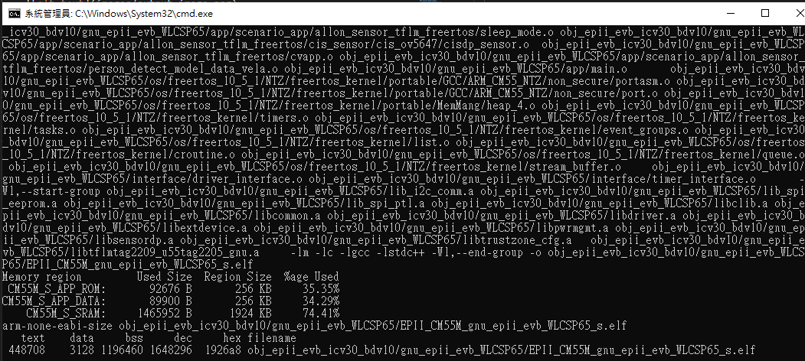
- Step 7: Generate firmware image file
    ```
    cd ../we2_image_gen_local/
    cp ../EPII_CM55M_APP_S/obj_epii_evb_icv30_bdv10/gnu_epii_evb_WLCSP65/EPII_CM55M_gnu_epii_evb_WLCSP65_s.elf input_case1_secboot/
    we2_local_image_gen project_case1_blp_wlcsp.json
    ```
- Output firmware image: `./output_case1_sec_wlcsp/output.img`
    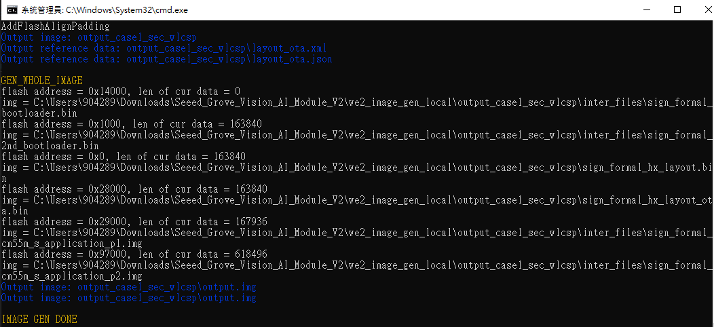


## How to flash the firmware?
This part explains how you can flash the firmware to Grove Vision AI Module V2.
### System Requirement
1. Grove Vision AI Module V2
2. Connection cable
    - Micro usb cable: connect to EVB (as Power/UART)
3. Software Tools
    Serial terminal emulation application
    - In the following description, `TeraTerm` and `Minicom` will be used.
        - Serial terminal emulation application Setting
            - Baud Rate 921600 bps
            - Data		8 bit
            - Parity		none
            - Stop		1 bit
            - Flow control	none
            - please check xmodem protocol is supported.
        - Minicom (for Linux PC)
            - Install minicom command
                ```
                sudo apt-get install minicom
                ```
            - Burn application to flash by using xmodem send application binary.
                - Minicom will extra install "lrzsz" package to support xmodem protocol
                    
                -  If you did not have “lrzsz” instruction, please install by following instruction.
                    ```
                    sudo apt-get install lrzsz #(to support xmodem protocol)
                    ```
            - Open the permissions to acceess the deivce
                ```
                sudo setfacl -m u:[USERNAME]:rw /dev/ttyUSB0
                # in my case
                # sudo setfacl -m u:kris:rw /dev/ttyACM0
                ```
                
            - Open minicom
                ```
                sudo minicom -s
                ```
                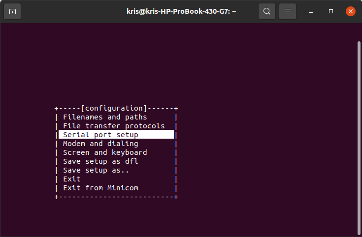
            - Setup serial port and COM Port name
                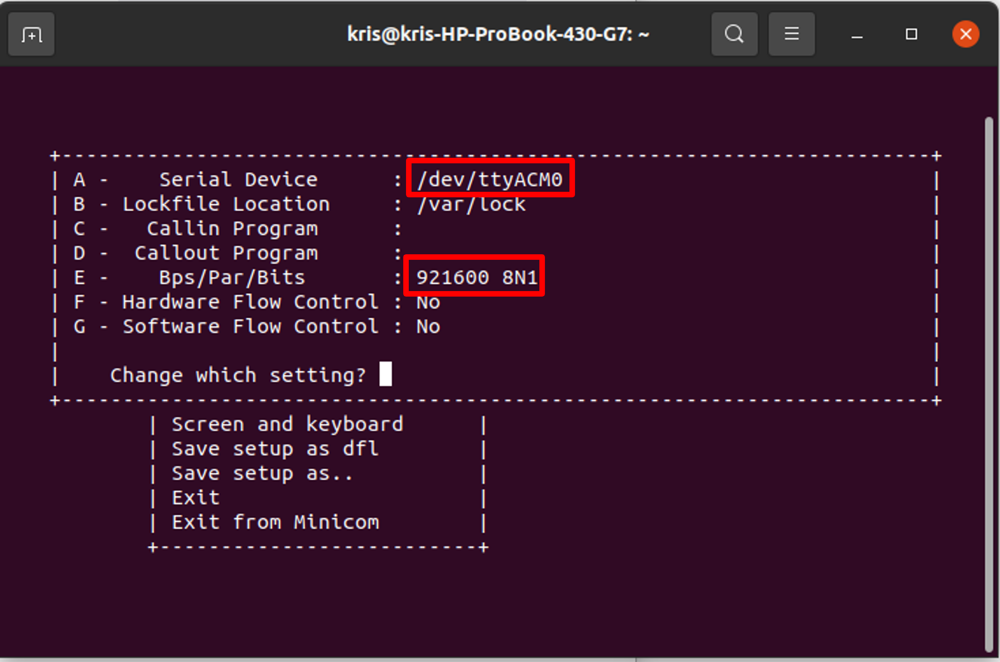
                - Tips for finding the COM Port name.
                  - You can use google chrome to connect to [Seeed SenseCraft AI](https://seeed-studio.github.io/SenseCraft-Web-Toolkit/#/setup/process), select `Grove Vision(V2)` and press `Connect`.
                    
                  - Then, you would get the COM Port name.
                    
        - TeraTerm (for Windows PC)
            - Setup serial port 
                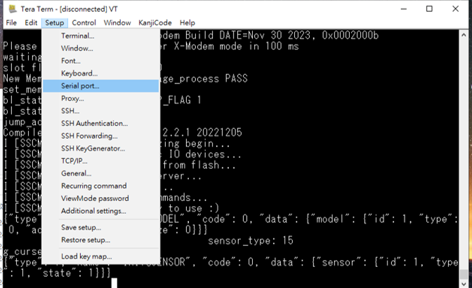
                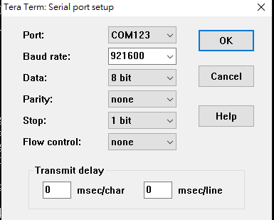


### Flash Image Update at Linux Environment
Following steps update application in the flash.
- Step 1: Open `Minicom`, setup serial port and COM Port name-> connect to Grove Vision AI Module V2. (Please reference the minicom part of [System Requirement](https://github.com/HimaxWiseEyePlus/Seeed_Grove_Vision_AI_Module_V2?tab=readme-ov-file#system-requirement))
    
- Step 2: Hold down any key on the keyboard (except the Enter key) and press the reset button to reset Grove Vision AI Module V2 and the startup options will be displayed.
    
- Step 3: Press button “1” and Grove Vision AI Module V2 will enter receiving mode after then.  
    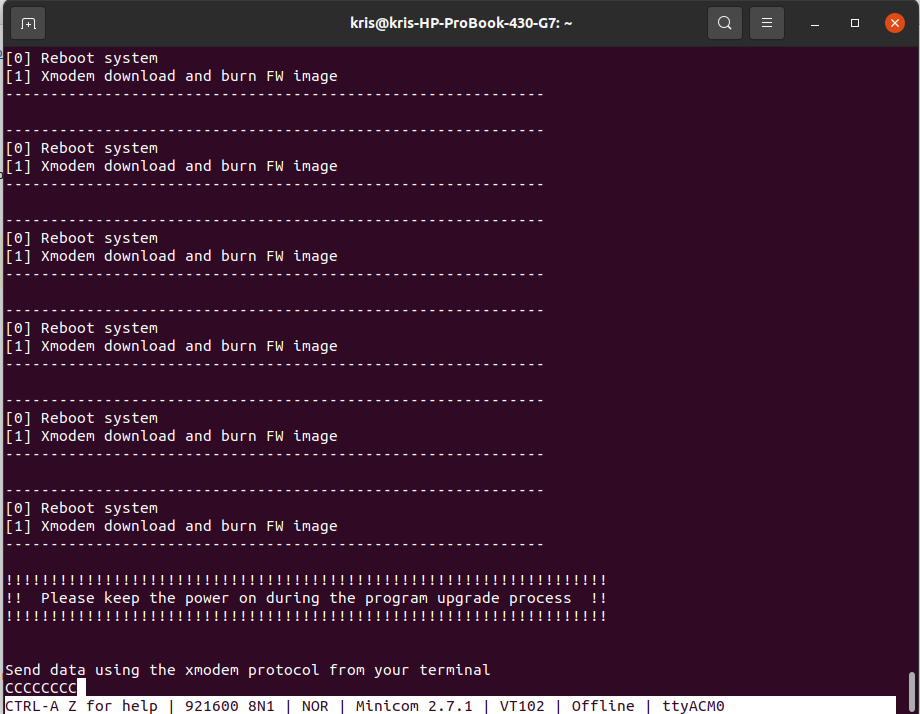
- Step 4: Press `Ctrl+A` on keyboard to enter minicom menu, and then press `s` on keyboard to upload file and select `xmodem`. 
    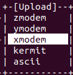
- Step 5: Select the firmware image at `Seeed_Grove_Vision_AI_Module_V2\we2_image_gen_local\output_case1_sec_wlcsp\output.img` and press `enter` to burn. 
    
- Step 6: After burning is compelete, press any key to be continue. 
    
- Step 7: Then, you will see the message "Do you want to end file transmission and reboot system? (y)" is displayed. Press button `y` to restart.
    
- Step 8: You will see the uart on `minicom` which is runing your algorithm.
    
### Flash Image Update at Windows Environment
Following steps update application in the flash.
- Step 1: Open `TeraTerm` and select File -> New connection, connect to Grove Vision AI Module V2.
    
- Step 2: Hold down any key on the keyboard (except the Enter key) and press the reset button to reset Grove Vision AI Module V2 and the startup options will be displayed.
    
- Step 3: Press button “1” and Grove Vision AI Module V2 will enter receiving mode after then. Select target flash image(output.img) by File->Transfer->XMODEM->Send. 
    
- Step 4: After the firmware image burning is completed, the message "Do you want to end file transmission and reboot system? (y)" is displayed. Press button `y` to restart.
    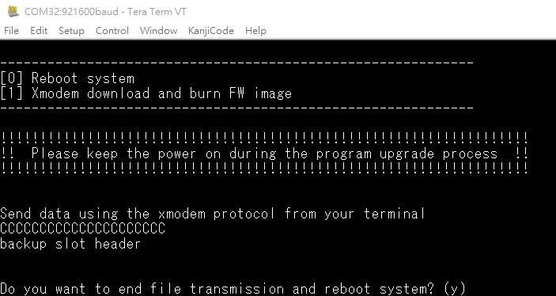
- Step 5: You will see the uart on `TeraTerm` which is runing your algorithm.
    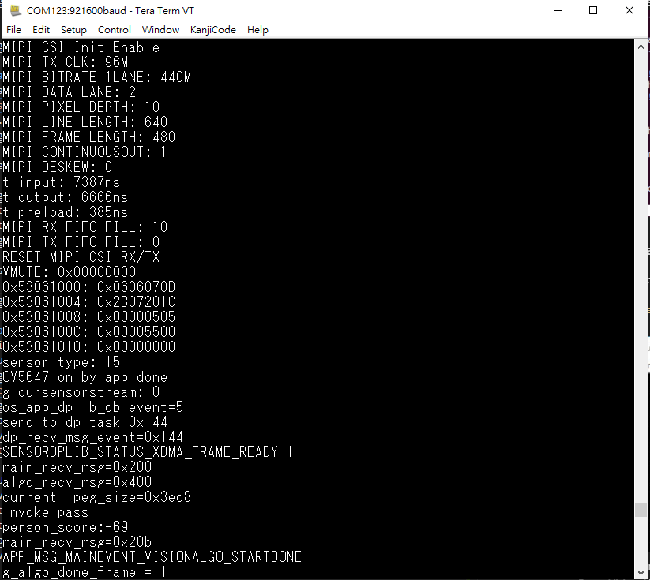

## How to restore to the original factory settings
### Linux Environment
- Update the flash image `Seeed_SenseCraft AI*.img` to Grove Vision AI Module V2 and press `reset` buttun.
    
- Disconnect the `Minicom`:
    - Please press `Ctrl+A` on keyboard and press `z` on keyboard to go to the menu of `minicom`.
        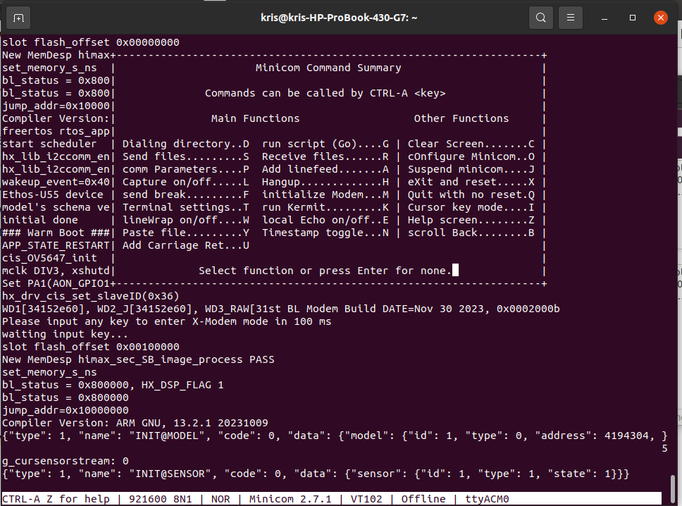
    - Then, press `q` on keyboard to quit with no reset `minicom`, and press `yes` to leave.
        

- Open the permissions to acceess the deivce
  ```
  sudo setfacl -m u:[USERNAME]:rw /dev/ttyUSB0
  # in my case
  # sudo setfacl -m u:kris:rw /dev/ttyACM0
  ```
  
- After doing the above steps, you can run the [SenseCraft AI](https://wiki.seeedstudio.com/grove_vision_ai_v2_software_support/#-no-code-getting-started-with-sensecraft-ai-) on Grove Vision AI Module V2.
  1. Introduction : https://wiki.seeedstudio.com/grove_vision_ai_v2/
  2. Connect Grove Vision AI Module to NB USB port
  3. Open "Google Chrome" browser
  4. Open [SenseCraft Homepage](https://seeed-studio.github.io/SenseCraft-Web-Toolkit/#/setup/process)
  5. Select "Grove Vision AI(WE2)" and connect (serial port)
    
    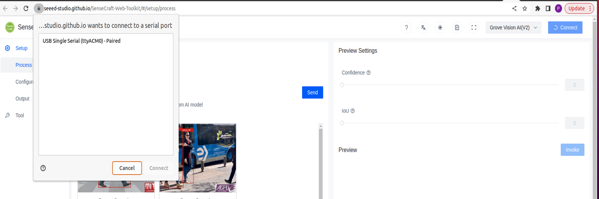
    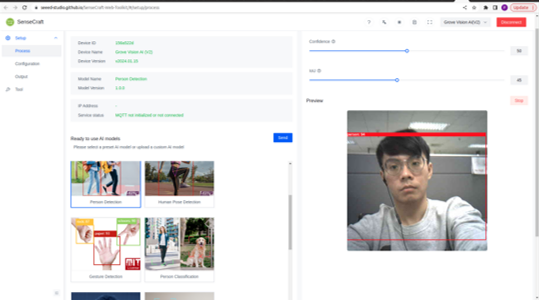
### Windows Environment
- Update the flash image `Seeed_SenseCraft AI*.img` to Grove Vision AI Module V2 and press `reset` buttun.
    
- Disconnect the `TeraTerm`.
    
- After doing the above steps, you can run the [SenseCraft AI](https://wiki.seeedstudio.com/grove_vision_ai_v2_software_support/#-no-code-getting-started-with-sensecraft-ai-) on Grove Vision AI Module V2.
  1. Introduction : https://wiki.seeedstudio.com/grove_vision_ai_v2/
  2. Install CH343 UART driver (CH343SER.ZIP) (Optional)
  3. Connect Grove Vision AI Module to NB USB port
  4. Open "Microsoft Edge" browser
  5. Open [SenseCraft Homepage](https://seeed-studio.github.io/SenseCraft-Web-Toolkit/#/setup/process)
  6. Select "Grove Vision AI(WE2)" and connect (serial port)

## How to build face mesh scenario_app and run on WE2?
### Linux Environment
- Change the `APP_TYPE` to `tflm_fd_fm` at [makefile](https://github.com/HimaxWiseEyePlus/Seeed_Grove_Vision_AI_Module_V2/blob/main/EPII_CM55M_APP_S/makefile)
    ```
    APP_TYPE = tflm_fd_fm
    ```
- Build the firmware reference the part of [Build the firmware at Linux environment](https://github.com/HimaxWiseEyePlus/Seeed_Grove_Vision_AI_Module_V2?tab=readme-ov-file#build-the-firmware-at-linux-environment)
- How to flash firmware image and model at [model_zoo](https://github.com/HimaxWiseEyePlus/Seeed_Grove_Vision_AI_Module_V2/tree/main/model_zoo)?
  - Prerequisites for xmodem
    - Please install the package at [xmodem/requirements.txt](https://github.com/HimaxWiseEyePlus/Seeed_Grove_Vision_AI_Module_V2/tree/main/xmodem/requirements.txt) 
        ```
        pip install -r xmodem/requirements.txt
        ```
  - Disconnect `Minicom`
  - Make sure your `Seeed Grove Vision AI Module V2` is connect to PC.
  - Open the permissions to acceess the deivce
    ```
    sudo setfacl -m u:[USERNAME]:rw /dev/ttyUSB0
    # in my case
    # sudo setfacl -m u:kris:rw /dev/ttyACM0
    ```
    
  - Open `Terminal` and key-in following command
    - port: the COM number of your `Seeed Grove Vision AI Module V2`, for example,`/dev/ttyACM0`
    - baudrate: 921600
    - file: your firmware image [maximum size is 1MB]
    - model: you can burn multiple models "[model tflite] [position of model on flash] [offset]"
      - Position of model on flash is defined at [~/tflm_fd_fm/common_config.h](https://github.com/HimaxWiseEyePlus/Seeed_Grove_Vision_AI_Module_V2/blob/main/EPII_CM55M_APP_S/app/scenario_app/tflm_fd_fm/common_config.h#L18)
    ```
    python3 xmodem/xmodem_send.py --port=[your COM number] --baudrate=921600 --protocol=xmodem --file=we2_image_gen_local/output_case1_sec_wlcsp/output.img --model="model_zoo/tflm_fd_fm/0_fd_0x200000.tflite 0x200000 0x00000" --model="model_zoo/tflm_fd_fm/1_fm_0x280000.tflite 0x280000 0x00000"  --model="model_zoo/tflm_fd_fm/2_il_0x32A000.tflite 0x32A000 0x00000"
    ```
    - It will start to burn firmware image and model automatically.
        
  -  Please press `reset` buttun on `Seeed Grove Vision AI Module V2` and it will success to run the algorithm.
    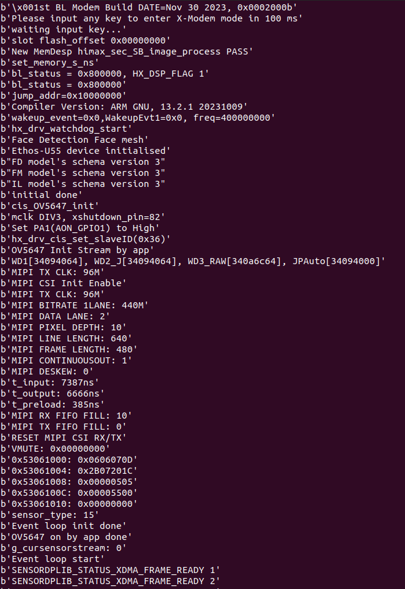
    

### Windows Environment
- Change the `APP_TYPE` to `tflm_fd_fm` at [makefile](https://github.com/HimaxWiseEyePlus/Seeed_Grove_Vision_AI_Module_V2/blob/main/EPII_CM55M_APP_S/makefile)
    ```
    APP_TYPE = tflm_fd_fm
    ```
- Build the firmware reference the part of [Build the firmware at Windows environment](https://github.com/HimaxWiseEyePlus/Seeed_Grove_Vision_AI_Module_V2?tab=readme-ov-file#build-the-firmware-at-windows-environment)
- How to flash firmware image and model at [model_zoo](https://github.com/HimaxWiseEyePlus/Seeed_Grove_Vision_AI_Module_V2/tree/main/model_zoo)?
  - Prerequisites for xmodem
    - Please install the package at [xmodem/requirements.txt](https://github.com/HimaxWiseEyePlus/Seeed_Grove_Vision_AI_Module_V2/tree/main/xmodem/requirements.txt) 
        ```
        pip install -r xmodem/requirements.txt
        ```
  - Disconnect `Tera Term`
  - Make sure your `Seeed Grove Vision AI Module V2` is connect to PC.
  - Open `CMD` and key-in following command
    - port: the COM number of your `Seeed Grove Vision AI Module V2` 
    - baudrate: 921600
    - file: your firmware image [maximum size is 1MB]
    - model: you can burn multiple models "[model tflite] [position of model on flash] [offset]"
      - Position of model on flash is defined at [~/tflm_fd_fm/common_config.h](https://github.com/HimaxWiseEyePlus/Seeed_Grove_Vision_AI_Module_V2/blob/main/EPII_CM55M_APP_S/app/scenario_app/tflm_fd_fm/common_config.h#L18)
    ```
    python xmodem\xmodem_send.py --port=[your COM number] --baudrate=921600 --protocol=xmodem --file=we2_image_gen_local\output_case1_sec_wlcsp\output.img --model="model_zoo\tflm_fd_fm\0_fd_0x200000.tflite 0x200000 0x00000" --model="model_zoo\tflm_fd_fm\1_fm_0x280000.tflite 0x280000 0x00000"  --model="model_zoo\tflm_fd_fm\2_il_0x32A000.tflite 0x32A000 0x00000"
    ```
    - It will start to burn firmware image and model automatically.
        
  -  Please press `reset` buttun on `Seeed Grove Vision AI Module V2` and it will success to run the algorithm.
    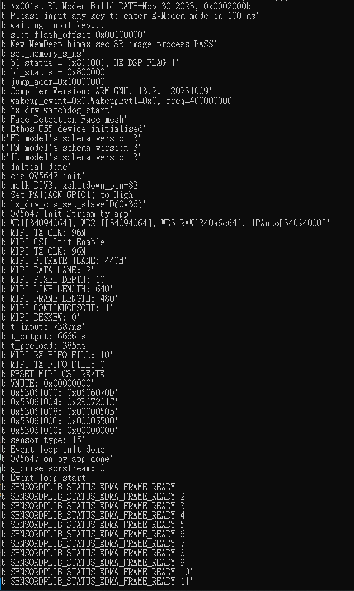
    

### Send image and meta data by UART
- Disconnect the uart at your `Tera Term` or `Minicom` first. 
You can use the [Himax AI web toolkit](https://github.com/HimaxWiseEyePlus/Seeed_Grove_Vision_AI_Module_V2/releases/download/v1.1/Himax_AI_web_toolkit.zip) which we provide, download it and unzip it to local PC, and double click `index.html`.
- Please check you select `Grove Vision AI(V2)` and press `connect` button
    
- Select your own COM.
    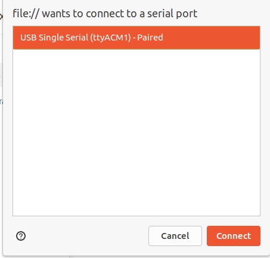
- You will see the preview result on website.
    
- Tip
    - Windows:
        - Please use "Microsoft Edge" browser
    - Linux:
        - Open the permissions to acceess the deivce
            ```
            sudo setfacl -m u:[USERNAME]:rw /dev/ttyUSB0
            # in my case
            # sudo setfacl -m u:kris:rw /dev/ttyACM0
            ```
        - Please use "Google Chrome" browser
### Model source link
- [Face detection](https://github.com/dog-qiuqiu/Yolo-Fastest)
- [Face mesh from google (468 point)](https://github.com/google/mediapipe/blob/master/docs/solutions/models.md#face-mesh)
- [Iris landmark](https://github.com/google/mediapipe/blob/master/docs/solutions/models.md#iris)

## How to add support for raspberry pi camera?
You can reference the scenario app [allon_sensor_tflm](https://github.com/HimaxWiseEyePlus/Seeed_Grove_Vision_AI_Module_V2/tree/main/EPII_CM55M_APP_S/app/scenario_app/allon_sensor_tflm) , [allon_sensor_tflm_freertos](https://github.com/HimaxWiseEyePlus/Seeed_Grove_Vision_AI_Module_V2/tree/main/EPII_CM55M_APP_S/app/scenario_app/allon_sensor_tflm_freertos) and [tflm_fd_fm](https://github.com/HimaxWiseEyePlus/Seeed_Grove_Vision_AI_Module_V2/tree/main/EPII_CM55M_APP_S/app/scenario_app/tflm_fd_fm).
Take allon_sensor_tflm for example, you should only modify the [allon_sensor_tflm.mk](https://github.com/HimaxWiseEyePlus/Seeed_Grove_Vision_AI_Module_V2/blob/main/EPII_CM55M_APP_S/app/scenario_app/allon_sensor_tflm/allon_sensor_tflm.mk#L37) from cis_ov5647 to cis_imx219 or cis_imx477.
```
#CIS_SUPPORT_INAPP_MODEL = cis_ov5647
CIS_SUPPORT_INAPP_MODEL = cis_imx219
#CIS_SUPPORT_INAPP_MODEL = cis_imx477
```
So that, it can support cis_imx219 or cis_imx477 camera.


